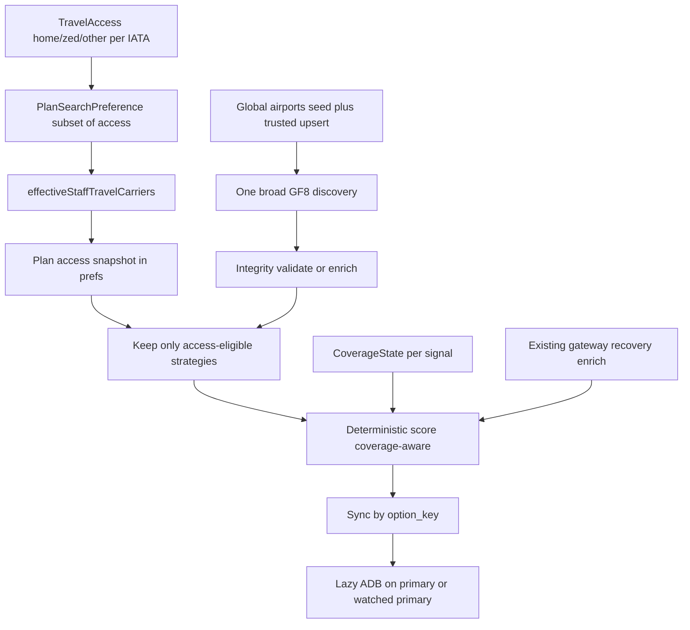

# Access-Aware Plan Engine (V2)

**Branch:** `cursor/plan-oriented-pivot-98c4`  
**Status:** PLAN ONLY — do not implement until reviewed and approved.  
**Do not merge to `main`.**

This revises [`docs/access-aware-plan-engine.md`](access-aware-plan-engine.md) using Lovable’s live provider/API/database audit. It preserves the good architecture (stable identity, GF8 broad discovery, deterministic access-aware ranking, gateway/recovery, Plan/watch, lazy ADB, access-aware runway, meaningful changes, no fake odds) and replaces United-centric / US-gated assumptions with an **airline-general, globally capable, coverage-aware** model.

---

## 1. Product invariants

1. Standbye is **airline-general staff travel**. `home` is the user’s relationship to an airline — never a privileged carrier (not UA-by-default).
2. Standbye is **globally capable** wherever traveler, airports, flights, and Plan can be resolved. US concentration is GTM, not eligibility.
3. **User-declared Travel Access only.** Never infer eligibility from alliance, codeshare, GF8, ADB, or marketing relationships.
4. **`effectiveStaffTravelCarriers ⊆ savedTravelAccess`.** Client may narrow; never expand staff-travel eligibility.
5. GF8 discovery coverage ≠ staff-travel eligibility. One broad GF8 call; filter locally to declared access.
6. **`flight_label` is display-only.** Canonical identity is deterministic segment-based `option_key`.
7. Access adds **friction**, not a hard `home > zed > other` rank order.
8. **Absence of data is never positive evidence.** Coverage and signal state are distinct.
9. Missing international FAA/BTS → honest “not covered / unavailable,” not “Normal” / not a penalty / not an event.
10. Provider failure is never a travel event.
11. Primary never silently changes; same-path/different-carrier itineraries stay distinct.
12. Never predict clearance or show fake boarding odds.
13. Paid fallback (`travelMode: staff | paid`) is **out of scope**; preserve fare metadata cheaply when present.
14. Do not encode airline “support tiers” as a hard product gate; coverage is plan/segment/signal-level.

---

## 2. Architecture diagram



---

## 3. Travel Access model

**Taxonomy (unchanged):** `home` | `zed` | `other` — airline-general.

```ts
type AccessType = "home" | "zed" | "other";
type AirlineAccessMeta = Record<string, { type: AccessType }>;
// e.g. DL home + AF/KL ZED; WN home-only; LH home + AC/UA ZED
```

**Profile UX modes (keep):** `home` | `partners` | `selected` in [`onboarding.ts`](../src/lib/aircue/onboarding.ts).

| Mode | Persisted codes | Meta typing |
|------|-----------------|-------------|
| `home` | `[homeAirline]` | home → `home` |
| `partners` | home + user-picked ZED codes | home → `home`; picks → `zed` |
| `selected` | home + picks | home → `home`; picks → `other` |

**Partners fix:** enable chip picker on partners step with ZED/interline copy (no alliance claims). Legacy partners with empty picks → home-only (current behavior).

**Legacy:** home airline → `home`; IATA in `airline_access` without meta → `other`. Never invent alliance partners.

**Remove United fallback:** [`plan.server.ts`](../src/lib/aircue/plan.server.ts) `homeAirline: row["home_airline"] ?? "UA"` must become missing/incomplete profile — never silent UA. Audit all runtime UA defaults (DB column defaults may remain for old rows; app layer must not invent UA). Test fixtures may keep UA.

---

## 4. Plan Search Preference model

**Travel Access** = persistent profile truth (airlines the traveler says they can staff-travel on).

**Plan Search Preference** = for this Plan only:

- all saved Travel Access, or
- a selected **subset** of saved Travel Access (including a single airline)

```ts
effectiveStaffTravelCarriers = selectedCarriers ∩ savedTravelAccess
// invariant: effective ⊆ saved
```

**Removed:** `all → null` unfiltered staff-travel discovery. There is no “search every airline as staff travel.”

GF8 still runs **one broad discovery** call; ineligible marketing/operator chains are dropped from the **staff-travel** candidate set after normalize/validate.

Store on the Plan (see §11): `prefs.travelAccessSnapshot`, `prefs.effectiveCarriers`, `prefs.accessMetaSnapshot`.

---

## 5. Airline resolution strategy

[`airlines.ts`](../src/lib/aircue/airlines.ts) is a **curated display roster**, not an eligibility allowlist.

| Case | Behavior |
|------|----------|
| Known curated IATA | Use curated name; logo via existing [`AirlineLogo`](../src/components/aircue/AirlineLogo.tsx) (gstatic + code tile fallback) |
| Valid/resolvable unknown IATA | Accept; display IATA as name fallback; no blocking |
| Metadata hydrate | Optional later via DB cache table; **do not** call external APIs merely to render a name on every card |

Onboarding/Home pickers: curated list for convenience + allow free-entry / typeahead of any 2–3 char IATA with validation (format + optional soft resolve). Home airline = any resolvable IATA.

---

## 6. Global airport strategy (**decision**)

**Recommend: hybrid curated global seed + trusted upsert with provenance.**

| Layer | Role |
|-------|------|
| **Seed** | Additive SQL seed of high-traffic international IATAs (FRA, LHR, CDG, HND, NRT, SIN, DXB, DOH, YYZ, SYD, …) with reliable `tz`, `icao`, `country`/`region`, coords — no runtime provider dependency for common paths |
| **Trusted upsert** | On Plan build, if origin/dest/connection IATA missing: resolve once (ADB airport metadata already used elsewhere), upsert into `airports` with `source`, `resolved_at`; never overwrite stronger curated fields with weaker data |
| **Soft degrade** | If resolve fails: do not hard-block solely for missing seed row when GF8 already returned the itinerary; persist codes; mark airport coverage `unknown` for geo-dependent signals |

**Why not seed-only:** infinite long-tail of IATAs; international Plans would keep failing.  
**Why not pure dynamic:** timezone/country inconsistency and provider dependency for every new code.  
**Why hybrid:** US behavior unchanged; common internationals offline-reliable; long-tail resolvable without making ADB a name renderer.

Schema notes: today’s [`airports`](../supabase/migrations/20260827003628_3cda5b92-d3cc-4f40-be66-4d01c008c8b7.sql) lacks `country` / provenance — additive columns required for coverage decisions.

---

## 7. Coverage-state model

Every intelligence layer distinguishes **coverage** from **signal**:

```ts
type CoverageState = "available" | "not_covered" | "unavailable" | "unknown";
// Signal may reuse PillarState or a parallel enum — preserve semantics:
// good | fair/mixed | poor | unknown
```

| Layer | Available when | Not covered | Unavailable |
|-------|----------------|-------------|-------------|
| Weather (AWC METAR/TAF) | Global where AWC returns | Rare | Fetch/cache failure |
| Ops disruption (FAA NAS) | US FAA airports | Non-US / outside NAS | FAA fetch failure |
| History (T-100 / On-Time) | US-centric source rows for that carrier/route | International / no row | Query/provider failure |
| Party-size availability (GF8) | Where ladder discriminates | — | GF8 failure; weak discrimination → low weight, not “US-only” |
| Schedule/status (ADB) | Lazy / when called | — | Quota/failure → unknown |

**Critical invariant:** no FAA program at LHR ≠ “Normal operations.” Copy like: *Live airport disruption coverage unavailable for this region* while still using weather if present.

Missing signal → reduce **confidence / evidence depth**, not automatic score penalty or bonus; never emit a meaningful-change event solely for missing coverage.

---

## 8. GF8 candidate strategy

- One broad GF8 search per Plan (practical); do **not** fan out per carrier.
- Normalize: segments, marketing carrier/number, OD, local times, connections, total arrival, optional `commercialFare` `{ amount, currency, bookingUrl? }`.
- **Incomplete segment times:** do **not** fabricate. Prefer (1) reject from trusted staff-travel options, or (2) if the option is otherwise important and ADB can fill authoritative times for that flight number/date, enrich once — otherwise remain untrusted/rejected. Document enrichment as optional narrow path, not default.
- Local filter: keep itineraries whose **staff-travel-relevant carriers** (marketing until verified; operator after verify) are ⊆ `effectiveStaffTravelCarriers`.
- Preserve nonstop sellable board path for availability buckets; merge candidates by `option_key`.
- Party-size: global-capable where discriminatory; never equate sellability with non-rev seats; do not overweight weak international discrimination.

---

## 9. ADB enrichment / operator strategy (**decision**)

ADB is global-capable and quota-limited (~1 req/s). **Lazy only:**

- User sets primary
- Watched primary recheck
- (No verify-all-candidates)

**Operator model:**

```ts
type OperatorVerification = "verified" | "unverified" | "unknown";
type StaffEligibility = "eligible" | "uncertain" | "ineligible";
```

| Situation | Eligibility | Ranking / UX |
|-----------|-------------|--------------|
| Pre-verify (marketing only) | `uncertain` (or `eligible` with `unverified` operator) | Classify access from marketing carrier; modest confidence haircut; still a usable staff-travel candidate |
| Verified operator = marketing | `eligible` | Access from that carrier’s declared type |
| Verified operator ≠ marketing | Recompute access from **operator** IATA | If operator ∈ access → retype (e.g. UA-marketed / LH-operated + LH ZED → ZED, not Home). If operator ∉ access → `ineligible`; do not pretend valid staff travel; surface honestly |
| ADB `codeshareStatus: Unknown` or no verify | Operator stays `unknown` | **Not invalid, not verified.** Option remains useful with uncertainty; never claim verified Home/ZED certainty |

Unknown ≠ ineligible. Ineligible is only for verified disqualifying operator (or all segments outside declared access).

---

## 10. Ranking implications

Keep pillars: availability, operations, history, recovery. Add internal adjustments (document weights at implementation):

- Access friction: modest `home` < `zed` < `other` — **not** a hard order
- `standbyClears` = segment count (generalize flat connection −12)
- Coverage-aware: missing/not_covered layers → confidence/evidence depth ↓; do not treat as “poor ops”
- Strong ZED may beat weak home; equal quality → home may win on friction; strong recovery may offset clears/friction
- History queries remain **carrier-generic** (T-100 already multi-carrier; On-Time UA-only is **ingestion debt**, separate task — do not giant-backfill inside this engine pass)
- History threshold bug: evaluate `lf >= 0.93` before `>= 0.87`
- No AI; no clearance probability

---

## 11. Watch / rerank access policy (**decision**)

**Recommend: immutable Travel Access snapshot at Plan creation.**

- Persist `prefs.travelAccessSnapshot` + `effectiveCarriers` (+ meta) when the Plan is built.
- `recheckWatch` / rerank **must** filter with that snapshot — never broaden because GF8 returned new airlines.
- Profile Travel Access edits do **not** silently rewrite active Plans or watches.
- Future (out of scope): explicit “Update this plan from my current access” action.

**Why snapshot fits the Plan mental model:** a Plan is committed intent (“ways I’m trying for this trip”), not a live binding to profile prefs. Accidental profile edits must not thrash a watched strategy. Server-authoritative create already defines the Plan’s staff-travel universe once.

Escape/Widen: resolve access the same way (server + snapshot on the resulting Plan).

---

## 12. Migration plan (expected filenames — do not apply until implementation approved)

| File | Purpose |
|------|---------|
| `supabase/migrations/20260829120000_plan_options_option_key.sql` | `plan_options.option_key text`; unique `(plan_id, option_key)` where not null; optional best-effort backfill from segments |
| `supabase/migrations/20260829120100_airline_access_meta.sql` | `standby_profiles.airline_access_meta jsonb NOT NULL DEFAULT '{}'` |
| `supabase/migrations/20260829120200_airports_global.sql` | Additive `country`/`region`, `source`, `resolved_at` (names flexible); seed high-traffic international rows; **no destructive US rewrite** |
| Drizzle mirrors under `drizzle/migrations/` if that tree stays in sync | Same additive changes |

Also audit DB defaults like `home_airline … DEFAULT 'UA'` / legacy `marketing_carrier default 'UA'` — prefer app-layer honesty over a risky mass UPDATE; document any DEFAULT change carefully.

**Do not apply migrations in-agent** if Lovable/Supabase applies them separately; ship SQL and report.

---

## 13. Backward compatibility

- Existing Plans/options keep working; null `option_key` falls back to `flight_label` until next trusted sync.
- Legacy profiles without meta: home + `airline_access` codes as above.
- Partners-empty → home-only (unchanged practical behavior).
- UA fixtures/tests stay; product defaults do not.
- Domestic ORD→CMH / existing watch/cancellation paths must not regress (Feature #1 intact).
- Home / Plans / Updates / You IA unchanged.

---

## 14. Revised Pass A / B / C sequence

### PASS A — Global-safe foundations

1. Stable `option_key` + sync/primary/watch identity  
2. Airline-general home; remove UA runtime fallback  
3. Open/resolvable airline display strategy  
4. Canonical Travel Access + partners semantics + `airline_access_meta`  
5. Server-authoritative Plan preference ⊆ access (no staff-travel `all`)  
6. Global airports hybrid seed + trusted upsert  
7. Coverage-state semantics wired into ops/history/weather evidence shapes  

### PASS B — Access-aware candidate / ranking engine

1. GF8 broad multi-segment candidates + integrity (reject/enrich policy)  
2. Access filter after normalize  
3. Segment access metadata + fare metadata retain  
4. Operator uncertainty / eligibility model (pre-lazy)  
5. Deterministic access friction + clears-aware + coverage-aware scoring  
6. History 0.93 threshold fix; carrier-generic history reads  
7. Preserve gateway/recovery; merge by `option_key`  

### PASS C — Plan / watch experience

1. Access-aware runway + dynamic “your airline” copy  
2. Meaningful change events (access composition / runway); no coverage-noise events  
3. Stable rerank identity; snapshot-constrained watch  
4. Lazy ADB operator verification on primary / watched primary  
5. Coverage-honest UI (Option/Plan/Updates minimal)  
6. International Plan persistence  
7. Regression protection + expanded test matrix  

---

## 15. Automated test matrix

**Airline-general profile:** UA / DL / WN / LH / arbitrary resolvable IATA home; missing home ≠ UA.

**Access:** home-only; home+ZED; selected subset; client cannot expand; no alliance inference.

**Identity:** same gateway, different carrier combos → different `option_key`; sync/primary survival.

**Domestic non-UA:** e.g. ATL→MCO under DL/WN context (fixtures/mocks).

**International fixtures:** FRA→SIN, ORD→SGN, HND→SIN (mocked GF8/ADB — no live burn).

**Coverage:** FAA-covered vs not; provider failure; history available / not covered / unavailable; missing ≠ good.

**Operator:** same; different (access retype / ineligible); unknown stays useful.

**Watch:** snapshot constraints; GF8 outside airline excluded; no fake event from missing coverage; primary survives same-path/different-carrier.

**Airports:** US + international persist; tz/ICAO/country; unknown airport safe degrade.

**History threshold:** 0.94 poor; 0.89 fair.

**Cancellation / Feature #1 / option-detail FK:** remain green.

---

## 16. Manual acceptance journeys

| Journey | Setup | Verify |
|---------|--------|--------|
| **A — US / United** | UA home, ORD→CMH | No domestic regression |
| **B — US / non-United** | DL home (+ declared access if useful) | DL as home; no UA assumptions; Plan/rank/watch OK |
| **C — International mixed** | e.g. LH home + declared ZED; FRA→SIN | Airports persist; discovery; access badges; weather; FAA/BTS honest; primary+watch |
| **D — Coverage by route** | International user, US-touching route (or reverse) | Coverage follows airport/signal, not home-airline nationality |

---

## 17. Out of scope

Clearance predictions; fake boarding odds; automated non-rev loads; alliance-derived eligibility; social load exchange; paid booking UI / mixing commercial into staff runway; hotel/rebooking; giant airline agreement graph; verify-all ADB; AI ranking; unrelated visual redesign; giant BTS On-Time backfill (separate data task); airlineSupportTier as product gate.

---

## 18. Risks / open questions

| Item | Notes |
|------|-------|
| Airport seed size | Start with audit-named hubs + major O&D; upsert covers long-tail |
| Upsert trust | Never clobber curated tz/country with partial ADB payloads |
| Incomplete GF8 times | Default reject from trusted set; enrichment only when ADB already justified |
| On-Time UA-only | Engine carrier-generic; ingestion expansion separate |
| Party-size internationally | Often weak discrimination — weight down, don’t disable |
| Snapshot vs profile drift | Snapshot chosen; document UX later for explicit refresh |
| DB `DEFAULT 'UA'` | App honesty first; schema default change optional/follow-up |
| Logo CDN gaps | IATA tile fallback already in AirlineLogo |

---

## 19. Exact files expected to change (implementation)

| Area | Files |
|------|--------|
| Identity / sync / primary / watch | [`plan.server.ts`](../src/lib/aircue/plan.server.ts), [`plan-watch-events.server.ts`](../src/lib/aircue/plan-watch-events.server.ts), [`watch-flight-state.server.ts`](../src/lib/aircue/watch-flight-state.server.ts) |
| Access / onboarding | [`onboarding.ts`](../src/lib/aircue/onboarding.ts), [`onboarding.tsx`](../src/routes/onboarding.tsx), [`welcome.tsx`](../src/routes/_authenticated/welcome.tsx), [`plan.functions.ts`](../src/lib/aircue/plan.functions.ts) |
| Airlines | [`airlines.ts`](../src/lib/aircue/airlines.ts), [`AirlineLogo.tsx`](../src/components/aircue/AirlineLogo.tsx) (minimal) |
| Airports | [`airport-lookup.server.ts`](../src/lib/aircue/airport-lookup.server.ts), [`airports.functions.ts`](../src/lib/aircue/airports.functions.ts), new upsert helper |
| GF8 / ranking | [`google-flights8.server.ts`](../src/lib/aircue/google-flights8.server.ts), [`ranking.server.ts`](../src/lib/aircue/ranking.server.ts), [`standby.ts`](../src/lib/aircue/standby.ts) |
| ADB verify | [`aerodatabox.server.ts`](../src/lib/aircue/aerodatabox.server.ts), [`flight-provider.server.ts`](../src/lib/aircue/flight-provider.server.ts), `setPrimaryOption` path |
| History | [`history.server.ts`](../src/lib/aircue/history.server.ts), ranking `historyFor` |
| UI | [`StandbyOptionRow.tsx`](../src/components/aircue/StandbyOptionRow.tsx), [`PlanDetailSections.tsx`](../src/components/aircue/PlanDetailSections.tsx), [`plan.index.tsx`](../src/routes/_authenticated/plan.index.tsx), Updates copy as needed |
| Types | [`integrations/supabase/types.ts`](../src/integrations/supabase/types.ts) after migrations |
| Tests | new/extended under [`src/lib/aircue/__tests__/`](../src/lib/aircue/__tests__/) |

---

## 20. Exact migrations expected

1. `20260829120000_plan_options_option_key.sql`  
2. `20260829120100_airline_access_meta.sql`  
3. `20260829120200_airports_global.sql` (columns + international seed + provenance)  
4. Matching drizzle files if required by repo convention  

No migrations in this plan-revision commit.

---

## Decisions locked in this V2 plan

1. **Global airports:** hybrid curated seed + trusted upsert with provenance (not seed-only, not pure dynamic).  
2. **Watched Plans vs profile access change:** immutable access snapshot at Plan creation; rerank never broadens; no silent profile refresh.  
3. **Unknown operating carrier:** remains `unknown` / uncertain — useful, not invalid, not verified; only verified disqualifying operator → `ineligible`.

---

## IMPLEMENTATION READINESS

| Area | Status |
|------|--------|
| Stable identity | **READY** |
| Travel Access | **READY** |
| Airline resolution | **READY WITH CAVEAT** (curated + IATA fallback; optional DB hydrate later) |
| Global airports | **READY WITH CAVEAT** (seed content list finalized at implement; upsert path required) |
| GF8 candidates | **READY** |
| Operator verification | **READY** |
| Ranking | **READY** |
| Coverage honesty | **READY** |
| Runway | **READY** |
| Watch | **READY** (snapshot policy locked) |
| International Plan persistence | **READY WITH CAVEAT** (depends on airport migration + upsert) |

### Overall: **GO**

No blocking unresolved product decision remains for coding to start after explicit approval. Caveats are implementation sequencing (airport seed contents, migration apply via Lovable/Supabase), not open architecture forks.

---

## Out of scope reminder

Do not implement from this document until product/technical review approves. Stay on `cursor/plan-oriented-pivot-98c4`. Do not merge to `main`.
