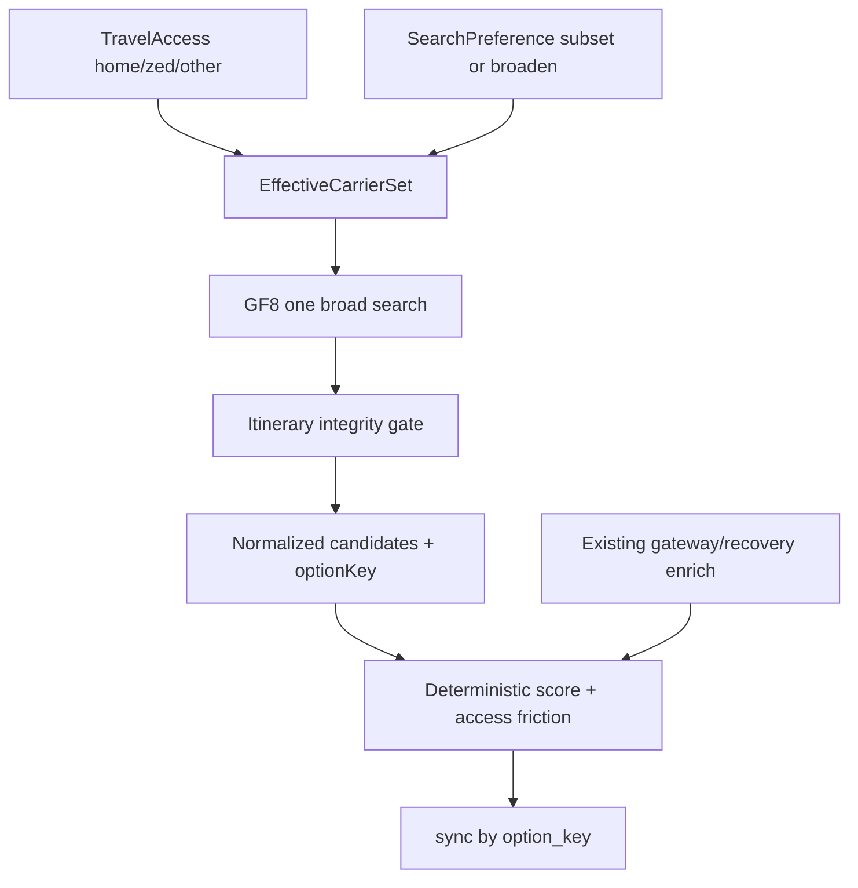

# Access-Aware Plan Engine

Work only on `cursor/plan-oriented-pivot-98c4`. Do not merge to `main`. Extend; do not rewrite Plan/watch/ranking foundations.

---

## PASS A — Integrity and travel access

### A1. Stable itinerary identity (`option_key`)

**Problem:** Connection `flight_label` is airport-path only (`ORD → NRT → SGN`), so UA+NH and UA+JL collide in [`syncPlanOptionsFromRanked`](../src/lib/aircue/plan.server.ts) (`byLabel` on `flight_label`).

**Approach:**
- Additive migration `supabase/migrations/20260829120000_plan_options_option_key.sql` (+ drizzle mirror if that folder stays in sync):
  - `plan_options.option_key text`
  - unique index `(plan_id, option_key)` where `option_key is not null`
  - no destructive rewrite; backfill best-effort from `segments` JSON when complete, else leave null and fall back to `flight_label` until next trusted sync
- Pure helper `buildOptionKey(segments)` e.g.  
  `UA881:ORD-HND:2026-10-15T17:00|NH891:HND-SGN:2026-10-16T09:00`  
  (carrier + number + OD + scheduled dep truncated to minute; deterministic; every segment)
- Store on `RankedOption` / `StandbyOption` as `optionKey`; persist via `optionInsert`
- Change sync matching to **`option_key` first**, `flight_label` only for legacy null-key rows
- Keep `flightLabel` as display only (connections can become `UA 881 → NH 891` while path stays in UI subtitle)
- Primary preservation: match primary row by `option_key` across reranks; never swap to another same-hub itinerary
- Watch snapshot identity: prefer `optionKey` where snapshots compare options

**Do not apply migrations in-agent** if Lovable/Supabase applies them separately; ship SQL and report filenames.

### A2–A3. Canonical access model + `airline_access_meta`

**Taxonomy (segment/option):** `home` | `zed` | `other` only. No alliance inference.

**Profile UX modes (keep):** `home` | `partners` | `selected` in [`onboarding.ts`](../src/lib/aircue/onboarding.ts).

| Mode | Persisted access | Meta typing |
|------|------------------|-------------|
| `home` | `[homeAirline]` | `{ UA: { type: "home" } }` |
| `partners` | home + user-picked ZED codes | home → `home`; picks → `zed` |
| `selected` | home + picks | home → `home`; picks → `other` |

**Partners fix (minimal):** today `resolvedAccess("partners")` returns `[]` so search collapses to home-only. Enable the existing airline chip picker on the partners step with ZED/interline copy (not alliance claims). Legacy partners profiles with empty picks keep current behavior (home only).

**Migration:** `20260829120100_airline_access_meta.sql` — `standby_profiles.airline_access_meta jsonb NOT NULL DEFAULT '{}'::jsonb`. Keep `airline_access text[]`.

**Resolvers** (single module, extend [`onboarding.ts`](../src/lib/aircue/onboarding.ts)):
- `resolveTravelAccess(profile)` → `{ codes, meta, byCarrier }`
- Legacy fallback: home airline → `home`; IATA in `airline_access` without meta → `other`; never invent alliance partners
- Deprecate accidental expansion via client arrays (see A4)

### A4. Server-authoritative `createPlan`

Mirror Escape: in [`createPlan`](../src/lib/aircue/plan.functions.ts) / [`buildPlan`](../src/lib/aircue/plan.server.ts), load profile and compute:

1. **Travel access** = permitted codes from profile  
2. **Search preference** from client: `profile` | single IATA | `all` (deliberate broaden)  
3. **Effective set** = preference ∩ access (except deliberate `all` → `null` unfiltered discovery)

Reject client carrier lists that expand beyond access when preference is not `all`. Store effective carriers + access snapshot in `plans.prefs` for recheck.

Home UI: keep builder simple; prefs label → **Travel access** / “Using your travel access” summary; default remains profile access.

---

## PASS B — Candidate discovery and ranking

### B5–B6. GF8 itinerary candidates + integrity gate

Extend [`google-flights8.server.ts`](../src/lib/aircue/google-flights8.server.ts) (do not remove nonstop board path used for availability buckets):

- New `searchItineraryCandidates(origin, dest, date, adults?)` — **one broad GF8 call** (carrier unfiltered), then local filter by effective access (every segment carrier in access set, or marketing chain allowed only if all legs permitted)
- Normalize: segments, marketing carrier/number, times, connection airports, total arrival, `commercialFare` `{ amount, currency, bookingUrl? }`
- **Reject** (never insert as trusted option) when: missing arr/dep, OD discontinuity, impossible chronology, layover below ~45–60m or absurdly long outside existing gateway caps, bad segment order
- Provider malformation = data quality, not a plan change event

### B7. Keep gateway/recovery

Keep [`findGateways`](../src/lib/aircue/ranking.server.ts) / recovery enrichment. GF8 owns broad multi-airline discovery; gateway logic answers “if this routing fails, what next?” Attach recovery/later shots to scored GF8 connections by hub when possible; avoid a second full discovery fan-out per airline.

Domestic baseline: continue ADB schedule nonstops + GF8 sellable board; **merge by `optionKey`** so domestic ORD→CMH does not regress.

### B8–B9. Segments access + fare metadata

Extend [`OptionSegment`](../src/lib/aircue/standby.ts) with `access: "home" | "zed" | "other"`. Derive option summary: `Home` / `ZED` / `Home + ZED` / `Other staff travel`. Persist in existing `segments` JSON (+ optional top-level `accessSummary`, `standbyClears`, `commercialFare` in evidence/JSON—avoid extra SQL columns unless needed for queries).

### B10–B11. Access-aware ranking (deterministic)

Keep pillars: availability, operations, history, recovery. Add **internal** adjustments (document weights here as implementation lands):

- Access friction: `home` < `zed` < `other` (modest points—not a hard order)
- `standbyClears` = segment count (connection penalty generalized; replace flat `scoreOf - 12` with clears-aware friction)
- **Invariant:** strong ZED can beat weak home; equal quality → home may win on lower friction; strong recovery can offset clears/access friction
- No AI; no fifth public pillar required for MVP

---

## PASS C — International honesty, runway, watch, UX

### C12. Coverage honesty

In operations/history builders ([`ranking.server.ts`](../src/lib/aircue/ranking.server.ts)):

- FAA: only claim FAA-backed state for US coverage; international → operations from weather only, UI/evidence: **Weather checked · Live airport disruption coverage unavailable**; state `unknown` when only weather is thin—**never** label false **Normal** solely because FAA list is empty
- BTS missing → history `unknown` / “Historical pattern unavailable”, not a positive signal

### C13. History threshold bug

In `historyFor`, evaluate `lf >= 0.93` **before** `>= 0.87`. Tests: 0.94 → Very tight/poor; 0.89 → Tighter/fair.

### C14. Access-aware backup runway

Extend [`BackupRunway`](../src/lib/aircue/plan-watch-events.server.ts): keep `totalRealisticWays` / `backupAlternatives`; add `accessBreakdown: { home, zed, other }` and compact summary line for UI.

### C15. Access-aware meaningful changes

Extend [`detectPlanChangeEvents`](../src/lib/aircue/plan-watch-events.server.ts) carefully (noise-safe):

- Emit on material runway shrink, preferred change, **staff-travel composition shift** (e.g. home options gone → only ZED), material better alternate
- Do **not** emit on score jitter, provider failure, missing FAA/BTS, rejected malformed candidates
- Preserve Feature #1 cancellation path unchanged

### C16. Lazy AeroDataBox operator verification

Call ADB only when option becomes important:

- `setPrimaryOption` → verify each segment; store operator verification on option evidence (`verified` / `unverified` / `unknown`)
- Watched primary recheck → re-verify primary segments only

If verified operator differs from marketing carrier, recompute segment `access`; if primary access becomes invalid, surface honestly (event + Plan Detail)—do not silently keep “home” semantics. Respect ADB budget/rate limits already in [`aerodatabox.server.ts`](../src/lib/aircue/aerodatabox.server.ts).

### UX (minimal)

- [`StandbyOptionRow`](../src/components/aircue/StandbyOptionRow.tsx) / Plan Detail: path, `UA 881 → NH 891`, access badge, optional clears count—no redesign
- Runway: `5 realistic ways remain` + `2 using your airline · 2 ZED · 1 other`
- Updates: event-first copy for runway/access shifts
- Onboarding/You: ZED copy only; no alliance guarantees

---

## Tests and verification

New/extended unit tests under `src/lib/aircue/__tests__/`:

- option key uniqueness (same hub, different carriers); sync/primary survival
- access resolvers + legacy + no alliance; createPlan cannot expand past access
- GF8 normalize UA+NH vs UA+LH; reject malformed
- ranking: strong ZED > weak home; home wins on equal+friction; clears penalty; recovery offset
- FAA/BTS honesty; history 0.93 branch
- runway totals + access breakdown
- watch: no fake events on provider failure; cancellation suite remains green

Run: `npx tsc --noEmit`, `bun test src/lib/aircue/__tests__/`, `npm run build`. Push to PR #2; do not merge.

Manual (Lovable/signed-in): ORD→CMH domestic baseline; ORD→SGN mixed access; primary UA+NH → watch → rerank identity stable.

---

## Out of scope

Paid-fare product UI, visual redesign, alliance graphs, per-carrier GF8 fan-out, verifying all candidates with ADB, predicting clearance odds.
