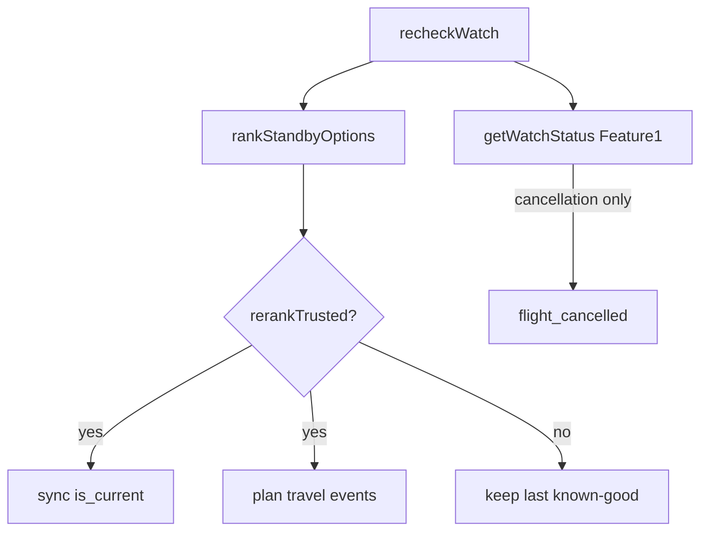

# Plan-oriented pivot integrity fixes

Fix state-integrity regressions on `cursor/plan-oriented-pivot-98c4` before merge: retire stale options via `is_current` (no FK-breaking deletes), skip plan travel events on failed/incomplete reranks, correct backup-runway math, restore load overlays on recheck, add regression tests, and fix the welcome CTA copy. Stay on this branch; do not merge to main.

## Review findings (current branch)

| # | Concern | Status |
|---|---------|--------|
| 1 | Stale `plan_options` after whole-plan recheck | **Broken** — [`syncPlanOptionsFromRanked`](../src/lib/aircue/plan.server.ts) upserts by `flight_label` and never retires missing rows; [`loadPlan`](../src/lib/aircue/plan.server.ts) counts all rows |
| 2 | Provider/incomplete rerank must not fire travel events | **Broken** — empty `syncedOptions` still runs `detectPlanChangeEvents` → can emit `backup_runway_shrunk`; Feature #1 cancel skip on `unavailable` is OK but does not gate plan events |
| 3 | Feature #1 cancellation | **Intact** — status-first path, dedupe, departed/unavailable helpers + integration tests still present |
| 4 | Load overlays through recheck | **Partial** — `reported_loads` rows survive; recheck builds options with `load: null`, so event judgments ignore overlays; `loadPlan`/`attachLoad` still overlay on read |
| 5 | `totalRealisticWays` vs backup-excluding-primary | **Broken** — [`computeBackupRunway`](../src/lib/aircue/plan-watch-events.server.ts) uses `options.length` for both |
| 6 | Known-flight sets primary when present | **OK** — [`planFromFlightNumber`](../src/lib/aircue/plan.server.ts) sets primary when the flight is present; needs a regression test |
| 7 | One active watch + pre-migration rows | **Mostly OK** — unique index + `beginWatch` reuse; migration does not backfill null `plan_id` or collapse duplicate actives before index |
| 8 | Typecheck/build/tests + new regressions | **Missing** for stale options / failed rerank / backup math |
| 9 | Welcome CTA | **Broken** — still `"Plan my first plan"` in [`welcome.tsx`](../src/routes/_authenticated/welcome.tsx) |



**Chosen approach for #1:** additive `plan_options.is_current boolean NOT NULL DEFAULT true`. Never delete option rows (preserves `primary_option_id` SET NULL and `watch_plans.plan_option_id` CASCADE). Successful sync marks unmatched rows `is_current=false` and synced rows `true`. Reads/events/runway use current rows only; watch/primary FKs may still point at non-current anchors (needed for cancellation).

---

## Implementation

### A. Migration (additive, Lovable-safe)

New file e.g. [`supabase/migrations/20260829050000_plan_options_is_current.sql`](../supabase/migrations/20260829050000_plan_options_is_current.sql):

- `ALTER TABLE plan_options ADD COLUMN IF NOT EXISTS is_current boolean NOT NULL DEFAULT true;`
- Backfill `watch_plans.plan_id` from `plan_options.plan_id` where `plan_id IS NULL`
- Before relying on uniqueness: for duplicate active `(user_id, plan_id)`, keep newest (`created_at`), set others `state='ended'`
- Update generated types in [`src/integrations/supabase/types.ts`](../src/integrations/supabase/types.ts): `plan_options.is_current`, `plans.primary_option_id`

### B. Sync + load path ([`plan.server.ts`](../src/lib/aircue/plan.server.ts))

**`syncPlanOptionsFromRanked` (trusted rechecks only):**

1. Load existing rows for plan
2. Upsert ranked by `flight_label` with `is_current: true`
3. Set `is_current: false` for existing IDs not in the synced set
4. Return only current synced options
5. Attach reported loads via `loadsFor` when building `StandbyOption`s (same as `loadPlan`) so recheck judgments/events see overlays

**`buildPlan` / escape insert:** set `is_current: true` on inserts (default covers this).

**`loadPlan` / `loadPlanSummaries`:** filter `.eq("is_current", true)` (or filter in memory). Preferred = rank-1 among current. Backup runway from current only. Primary ID may reference a non-current row; UI already handles missing primary in current list.

**`setPrimaryOption`:** require option belongs to plan; allow current rows only for new primaries (reject non-current).

### C. Failed/incomplete rerank gate ([`recheckWatch`](../src/lib/aircue/plan.server.ts) + [`ranking.server.ts`](../src/lib/aircue/ranking.server.ts))

1. Add `incomplete: boolean` on `RankResult` — `true` when any board was budget/provider-blocked even if some options returned; `data_unavailable` when empty because blocked
2. In `recheckWatch`, after ranking:
   - `rerankTrusted = !ranked.incomplete && ranked.reason !== "data_unavailable"`
   - If **not** trusted: do **not** call sync; do **not** run `detectPlanChangeEvents` / `detectAnchorOptionEvents`; keep prior snapshot runway/preferred fields; still write `last_checked_at` / `next_check_at` and still persist Feature #1 `flight_cancelled` if emitted
   - If trusted (including legitimate empty `day_over` / `no_service` / `carrier_filter`): sync + detect events as today

Feature #1 path (status → classify → `shouldEmitCancellation`) stays unchanged and runs before the gate.

### D. Backup runway split ([`plan-watch-events.server.ts`](../src/lib/aircue/plan-watch-events.server.ts), [`standby.ts`](../src/lib/aircue/standby.ts))

```ts
computeBackupRunway(options, primaryOptionId?: string | null): BackupRunway
// totalRealisticWays = options.length
// backupAlternatives = options excluding primary
// nonstops/connections on totalRealisticWays (use total for UI breakdown)
// summary: `${totalRealisticWays} realistic ways remain · …`
// snapshot backupRunwayCount / shrink thresholds: use backupAlternatives
```

Update [`StandbyPlan.backupRunway`](../src/lib/aircue/standby.ts) shape and [`PlanDetailSections`](../src/components/aircue/PlanDetailSections.tsx) to keep showing `summary` only (no UI redesign).

### E. Known-flight / watches (verify + harden)

- Keep [`planFromFlightNumber`](../src/lib/aircue/plan.server.ts) primary set when label present; add test
- [`beginWatch`](../src/lib/aircue/plan.server.ts): keep plan-scoped dedupe; after migration backfill, null-`plan_id` actives should be rare
- Copy: [`welcome.tsx`](../src/routes/_authenticated/welcome.tsx) `"Plan my first plan"` → `"Build my first plan"`

### F. Tests

Extend [`recheck-watch.test.ts`](../src/lib/aircue/__tests__/recheck-watch.test.ts) and add [`plan-watch-events.test.ts`](../src/lib/aircue/__tests__/plan-watch-events.test.ts):

1. **Stale options:** successful recheck with subset → prior labels marked non-current (mock asserts `is_current` updates); events/runway ignore them
2. **Provider failure / incomplete:** `data_unavailable` or `incomplete: true` with empty/partial options → no `backup_runway_shrunk` / preferred / ops events; snapshot `backupRunwayCount` unchanged; options not wiped
3. **Backup runway:** 3 options with primary → `totalRealisticWays=3`, `backupAlternatives=2`; shrink uses alternatives
4. **Feature #1:** existing cases 1–5, 9–12 stay green; optionally assert departed updates `flightState` without cancel
5. **Known-flight primary:** unit/integration assert `primary_option_id` set when ranked contains the flight
6. **Load overlay:** recheck with a `reported_loads` row applies load judgment on synced current option (mock)

### G. Verification (before any merge)

On `cursor/plan-oriented-pivot-98c4` only:

```bash
npx tsc --noEmit
npm run build
bun test
```

Commit + push fixes; update PR #2. **Do not merge to main.** Report findings + test results in the PR/summary.

---

## Todos

- [ ] Add `is_current` migration + watch `plan_id` backfill/dedupe + `types.ts`
- [ ] Sync marks non-current; `loadPlan`/events use current only; apply loads on recheck sync
- [ ] Ranking `incomplete` flag + `recheckWatch` preserves known-good and skips travel events on failure
- [ ] Split `totalRealisticWays` vs `backupAlternatives`; keep UI summary wording
- [ ] Fix welcome CTA to **Build my first plan**
- [ ] Add tests for stale options, failed/incomplete rerank, backup runway, known-flight primary, loads
- [ ] Run `tsc`, build, full `bun test`; push branch; report — no merge to main

---

## Out of scope

- UI redesign / new product features
- Deleting `plan_options` rows
- Notification delivery
- Changing Feature #1 cancellation semantics beyond regression verification
